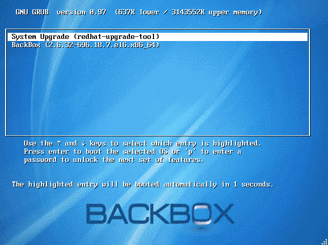
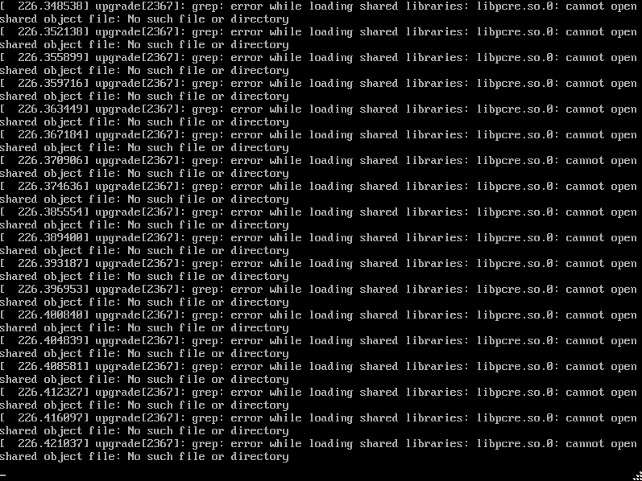
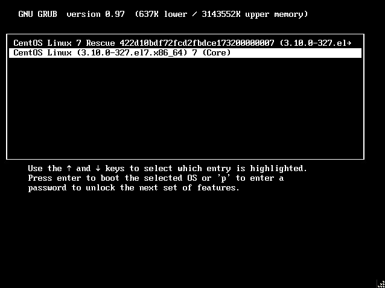

# How we upgraded our BackBox CentOS 6 to CentOS 7

One of the challenges every organization faces is the the lack of capability to do an in place upgrade of CentOS 6.x to CentOS 7. At the moment, the only official method of upgrading major versions of CentOS is to wipe and reinstall everything. Having said that, there were always processes you could follow with varying levels of success (based on straying from the official repositories and how customized your setup and package list was). We have run through this process now with a 99% success rate, `on our systems`, with over a hundred successful upgrades, so let’s break everything down.

Let's get the obvious stuff out of the way:
## Disclaimer
By making use of any information on this website, you agree to the following:All of the information provided here is provided "AS-IS" and with `NO WARRANTIES`. No express or implied warranties of any type, including for example implied warranties of merchantability or fitness for a particular purpose, are made with respect to the information, or any use of the information, on this site. BackBox makes no representations and extends no warranties of any type as to the accuracy or completeness of any information or content on this website.

BackBox specifically `DISCLAIMS LIABILITY FOR INCIDENTAL OR CONSEQUENTIAL DAMAGES` and assumes no responsibility or liability for any loss or damage suffered by any person as a result of the use or misuse of any of the information or content on this website. Concept2 assumes or undertakes NO LIABILITY for any loss or damage suffered as a result of the use, misuse or reliance on the information and content on this website.

### **USE AT YOUR OWN RISK**
This is for informational purposes only. 
## Back your system up!
Since our system is probably vastly different from yours it would be foolish to try thing without preparing a proper backup of your setup.

We suggest creating a copy of your setup as a virtual machine and taking snapshots between the steps demonstrated in this guide.

## Get the tools:
We're going to need a few things to do this.
1. A CentOS 7 ISO/repo with __an upgrade image__, we used [this one](http://vault.centos.org/centos/7.2.1511/os/x86_64/isolinux/)
1. The infamous redhat upgrade tool
1. Patience

##### You will need access to all the RPMs that you installed (along with all their dependencies). These should be located on your install media
##### This is the most challenging part — compiling the RPMs and resolving dependencies.
Download the redhat upgrade tool and place it on your machine.
```bash
[root@localhost upgrade]# ls
preupgrade-assistant-1.0.2-33.0.3.el6.centos.x86_64.rpm  preupgrade-assistant-contents-0.5.13-1.0.5.el6.centos.noarch.rpm  redhat-upgrade-tool-0.7.22-3.el6.centos.noarch.rpm

[root@localhost upgrade]# rpm -Uvh *.rpm
error: Failed dependencies:
        openscap(x86-64) >= 0:0.9.3-1 is needed by preupgrade-assistant-1.0.2-33.0.3.el6.centos.x86_64
        pkgconfig(libpcre) is needed by preupgrade-assistant-1.0.2-33.0.3.el6.centos.x86_64
        pkgconfig(libxml-2.0) is needed by preupgrade-assistant-1.0.2-33.0.3.el6.centos.x86_64
        pkgconfig(libxslt) is needed by preupgrade-assistant-1.0.2-33.0.3.el6.centos.x86_64
```
After resolving the dependency issues we'll install everything using yum to make sure we don't miss anything:
```bash
[root@localhost upgrade]# yum localinstall *.rpm --disablerepo=*
Loaded plugins: fastestmirror, presto
Setting up Local Package Process
Examining elfutils-0.164-2.el6.x86_64.rpm: elfutils-0.164-2.el6.x86_64
Marking elfutils-0.164-2.el6.x86_64.rpm to be installed
Loading mirror speeds from cached hostfile
Examining fakeroot-1.12.2-22.2.el6.x86_64.rpm: fakeroot-1.12.2-22.2.el6.x86_64
Marking fakeroot-1.12.2-22.2.el6.x86_64.rpm to be installed
Examining fakeroot-libs-1.12.2-22.2.el6.x86_64.rpm: fakeroot-libs-1.12.2-22.2.el6.x86_64
Marking fakeroot-libs-1.12.2-22.2.el6.x86_64.rpm to be installed
Examining GConf2-2.28.0-7.el6.x86_64.rpm: GConf2-2.28.0-7.el6.x86_64
Marking GConf2-2.28.0-7.el6.x86_64.rpm to be installed
Examining gdb-7.2-92.el6.x86_64.rpm: gdb-7.2-92.el6.x86_64
Marking gdb-7.2-92.el6.x86_64.rpm to be installed
Examining libgcrypt-devel-1.4.5-12.el6_8.x86_64.rpm: libgcrypt-devel-1.4.5-12.el6_8.x86_64
Marking libgcrypt-devel-1.4.5-12.el6_8.x86_64.rpm to be installed
Examining libgpg-error-devel-1.7-4.el6.x86_64.rpm: libgpg-error-devel-1.7-4.el6.x86_64
Marking libgpg-error-devel-1.7-4.el6.x86_64.rpm to be installed
Examining libIDL-0.8.13-2.1.el6.x86_64.rpm: libIDL-0.8.13-2.1.el6.x86_64
Marking libIDL-0.8.13-2.1.el6.x86_64.rpm to be installed
Examining libxml2-devel-2.7.6-21.el6_8.1.x86_64.rpm: libxml2-devel-2.7.6-21.el6_8.1.x86_64
Marking libxml2-devel-2.7.6-21.el6_8.1.x86_64.rpm to be installed
Examining libxslt-devel-1.1.26-2.el6_3.1.x86_64.rpm: libxslt-devel-1.1.26-2.el6_3.1.x86_64
Marking libxslt-devel-1.1.26-2.el6_3.1.x86_64.rpm to be installed
Examining openscap-1.0.8-1.0.1.el6.centos.x86_64.rpm: openscap-1.0.8-1.0.1.el6.centos.x86_64
Marking openscap-1.0.8-1.0.1.el6.centos.x86_64.rpm to be installed
Examining openscap-content-1.0.8-1.0.1.el6.centos.noarch.rpm: openscap-content-1.0.8-1.0.1.el6.centos.noarch
Marking openscap-content-1.0.8-1.0.1.el6.centos.noarch.rpm to be installed
Examining openscap-devel-1.0.8-1.0.1.el6.centos.x86_64.rpm: openscap-devel-1.0.8-1.0.1.el6.centos.x86_64
Marking openscap-devel-1.0.8-1.0.1.el6.centos.x86_64.rpm to be installed
Examining openscap-engine-sce-1.0.8-1.0.1.el6.centos.x86_64.rpm: openscap-engine-sce-1.0.8-1.0.1.el6.centos.x86_64
Marking openscap-engine-sce-1.0.8-1.0.1.el6.centos.x86_64.rpm to be installed
Examining openscap-engine-sce-devel-1.0.8-1.0.1.el6.centos.x86_64.rpm: openscap-engine-sce-devel-1.0.8-1.0.1.el6.centos.x86_64
Marking openscap-engine-sce-devel-1.0.8-1.0.1.el6.centos.x86_64.rpm to be installed
Examining openscap-extra-probes-1.0.8-1.0.1.el6.centos.x86_64.rpm: openscap-extra-probes-1.0.8-1.0.1.el6.centos.x86_64
Marking openscap-extra-probes-1.0.8-1.0.1.el6.centos.x86_64.rpm to be installed
Examining openscap-python-1.0.8-1.0.1.el6.centos.x86_64.rpm: openscap-python-1.0.8-1.0.1.el6.centos.x86_64
Marking openscap-python-1.0.8-1.0.1.el6.centos.x86_64.rpm to be installed
Examining openscap-utils-1.0.8-1.0.1.el6.centos.x86_64.rpm: openscap-utils-1.0.8-1.0.1.el6.centos.x86_64
Marking openscap-utils-1.0.8-1.0.1.el6.centos.x86_64.rpm to be installed
Examining ORBit2-2.14.17-6.el6_8.x86_64.rpm: ORBit2-2.14.17-6.el6_8.x86_64
Marking ORBit2-2.14.17-6.el6_8.x86_64.rpm to be installed
Examining patch-2.6-6.el6.x86_64.rpm: patch-2.6-6.el6.x86_64
patch-2.6-6.el6.x86_64.rpm: does not update installed package.
Examining pcre-devel-7.8-7.el6.x86_64.rpm: pcre-devel-7.8-7.el6.x86_64
Marking pcre-devel-7.8-7.el6.x86_64.rpm to be installed
Examining preupgrade-assistant-1.0.2-33.0.3.el6.centos.x86_64.rpm: preupgrade-assistant-1.0.2-33.0.3.el6.centos.x86_64
Marking preupgrade-assistant-1.0.2-33.0.3.el6.centos.x86_64.rpm to be installed
Examining preupgrade-assistant-contents-0.5.13-1.0.5.el6.centos.noarch.rpm: preupgrade-assistant-contents-0.5.13-1.0.5.el6.centos.noarch
Marking preupgrade-assistant-contents-0.5.13-1.0.5.el6.centos.noarch.rpm to be installed
Examining redhat-rpm-config-9.0.3-51.el6.centos.noarch.rpm: redhat-rpm-config-9.0.3-51.el6.centos.noarch
Marking redhat-rpm-config-9.0.3-51.el6.centos.noarch.rpm to be installed
Examining redhat-upgrade-tool-0.7.22-3.el6.centos.noarch.rpm: 1:redhat-upgrade-tool-0.7.22-3.el6.centos.noarch
Marking redhat-upgrade-tool-0.7.22-3.el6.centos.noarch.rpm to be installed
Examining rpm-build-4.8.0-55.el6.x86_64.rpm: rpm-build-4.8.0-55.el6.x86_64
Marking rpm-build-4.8.0-55.el6.x86_64.rpm to be installed
Examining rpmdevtools-7.5-2.el6.noarch.rpm: rpmdevtools-7.5-2.el6.noarch
Marking rpmdevtools-7.5-2.el6.noarch.rpm to be installed
Examining sgml-common-0.6.3-33.el6.noarch.rpm: sgml-common-0.6.3-33.el6.noarch
Marking sgml-common-0.6.3-33.el6.noarch.rpm to be installed
Resolving Dependencies
--> Running transaction check
---> Package GConf2.x86_64 0:2.28.0-7.el6 will be installed
---> Package ORBit2.x86_64 0:2.14.17-6.el6_8 will be installed
---> Package elfutils.x86_64 0:0.164-2.el6 will be installed
---> Package fakeroot.x86_64 0:1.12.2-22.2.el6 will be installed
---> Package fakeroot-libs.x86_64 0:1.12.2-22.2.el6 will be installed
---> Package gdb.x86_64 0:7.2-92.el6 will be installed
---> Package libIDL.x86_64 0:0.8.13-2.1.el6 will be installed
---> Package libgcrypt-devel.x86_64 0:1.4.5-12.el6_8 will be installed
---> Package libgpg-error-devel.x86_64 0:1.7-4.el6 will be installed
---> Package libxml2-devel.x86_64 0:2.7.6-21.el6_8.1 will be installed
---> Package libxslt-devel.x86_64 0:1.1.26-2.el6_3.1 will be installed
---> Package openscap.x86_64 0:1.0.8-1.0.1.el6.centos will be installed
---> Package openscap-content.noarch 0:1.0.8-1.0.1.el6.centos will be installed
---> Package openscap-devel.x86_64 0:1.0.8-1.0.1.el6.centos will be installed
---> Package openscap-engine-sce.x86_64 0:1.0.8-1.0.1.el6.centos will be installed
---> Package openscap-engine-sce-devel.x86_64 0:1.0.8-1.0.1.el6.centos will be installed
---> Package openscap-extra-probes.x86_64 0:1.0.8-1.0.1.el6.centos will be installed
---> Package openscap-python.x86_64 0:1.0.8-1.0.1.el6.centos will be installed
---> Package openscap-utils.x86_64 0:1.0.8-1.0.1.el6.centos will be installed
---> Package pcre-devel.x86_64 0:7.8-7.el6 will be installed
---> Package preupgrade-assistant.x86_64 0:1.0.2-33.0.3.el6.centos will be installed
---> Package preupgrade-assistant-contents.noarch 0:0.5.13-1.0.5.el6.centos will be installed
---> Package redhat-rpm-config.noarch 0:9.0.3-51.el6.centos will be installed
---> Package redhat-upgrade-tool.noarch 1:0.7.22-3.el6.centos will be installed
---> Package rpm-build.x86_64 0:4.8.0-55.el6 will be installed
---> Package rpmdevtools.noarch 0:7.5-2.el6 will be installed
---> Package sgml-common.noarch 0:0.6.3-33.el6 will be installed
--> Finished Dependency Resolution

Dependencies Resolved

==================================================================================================================================================================================================================
 Package                                           Arch                       Version                                     Repository                                                                         Size
==================================================================================================================================================================================================================
Installing:
 GConf2                                            x86_64                     2.28.0-7.el6                                /GConf2-2.28.0-7.el6.x86_64                                                       5.8 M
 ORBit2                                            x86_64                     2.14.17-6.el6_8                             /ORBit2-2.14.17-6.el6_8.x86_64                                                    581 k
 elfutils                                          x86_64                     0.164-2.el6                                 /elfutils-0.164-2.el6.x86_64                                                      662 k
 fakeroot                                          x86_64                     1.12.2-22.2.el6                             /fakeroot-1.12.2-22.2.el6.x86_64                                                  170 k
 fakeroot-libs                                     x86_64                     1.12.2-22.2.el6                             /fakeroot-libs-1.12.2-22.2.el6.x86_64                                              78 k
 gdb                                               x86_64                     7.2-92.el6                                  /gdb-7.2-92.el6.x86_64                                                            5.3 M
 libIDL                                            x86_64                     0.8.13-2.1.el6                              /libIDL-0.8.13-2.1.el6.x86_64                                                     210 k
 libgcrypt-devel                                   x86_64                     1.4.5-12.el6_8                              /libgcrypt-devel-1.4.5-12.el6_8.x86_64                                            202 k
 libgpg-error-devel                                x86_64                     1.7-4.el6                                   /libgpg-error-devel-1.7-4.el6.x86_64                                               26 k
 libxml2-devel                                     x86_64                     2.7.6-21.el6_8.1                            /libxml2-devel-2.7.6-21.el6_8.1.x86_64                                            8.5 M
 libxslt-devel                                     x86_64                     1.1.26-2.el6_3.1                            /libxslt-devel-1.1.26-2.el6_3.1.x86_64                                            3.0 M
 openscap                                          x86_64                     1.0.8-1.0.1.el6.centos                      /openscap-1.0.8-1.0.1.el6.centos.x86_64                                            42 M
 openscap-content                                  noarch                     1.0.8-1.0.1.el6.centos                      /openscap-content-1.0.8-1.0.1.el6.centos.noarch                                   672 k
 openscap-devel                                    x86_64                     1.0.8-1.0.1.el6.centos                      /openscap-devel-1.0.8-1.0.1.el6.centos.x86_64                                     491 k
 openscap-engine-sce                               x86_64                     1.0.8-1.0.1.el6.centos                      /openscap-engine-sce-1.0.8-1.0.1.el6.centos.x86_64                                 34 k
 openscap-engine-sce-devel                         x86_64                     1.0.8-1.0.1.el6.centos                      /openscap-engine-sce-devel-1.0.8-1.0.1.el6.centos.x86_64                          6.9 k
 openscap-extra-probes                             x86_64                     1.0.8-1.0.1.el6.centos                      /openscap-extra-probes-1.0.8-1.0.1.el6.centos.x86_64                              101 k
 openscap-python                                   x86_64                     1.0.8-1.0.1.el6.centos                      /openscap-python-1.0.8-1.0.1.el6.centos.x86_64                                    2.3 M
 openscap-utils                                    x86_64                     1.0.8-1.0.1.el6.centos                      /openscap-utils-1.0.8-1.0.1.el6.centos.x86_64                                     121 k
 pcre-devel                                        x86_64                     7.8-7.el6                                   /pcre-devel-7.8-7.el6.x86_64                                                      957 k
 preupgrade-assistant                              x86_64                     1.0.2-33.0.3.el6.centos                     /preupgrade-assistant-1.0.2-33.0.3.el6.centos.x86_64                              1.6 M
 preupgrade-assistant-contents                     noarch                     0.5.13-1.0.5.el6.centos                     /preupgrade-assistant-contents-0.5.13-1.0.5.el6.centos.noarch                     4.1 M
 redhat-rpm-config                                 noarch                     9.0.3-51.el6.centos                         /redhat-rpm-config-9.0.3-51.el6.centos.noarch                                     135 k
 redhat-upgrade-tool                               noarch                     1:0.7.22-3.el6.centos                       /redhat-upgrade-tool-0.7.22-3.el6.centos.noarch                                   251 k
 rpm-build                                         x86_64                     4.8.0-55.el6                                /rpm-build-4.8.0-55.el6.x86_64                                                    316 k
 rpmdevtools                                       noarch                     7.5-2.el6                                   /rpmdevtools-7.5-2.el6.noarch                                                     216 k
 sgml-common                                       noarch                     0.6.3-33.el6                                /sgml-common-0.6.3-33.el6.noarch                                                  133 k

Transaction Summary
==================================================================================================================================================================================================================
Install      27 Package(s)

Total size: 78 M
Installed size: 78 M
Is this ok [y/N]: y
Downloading Packages:
Running rpm_check_debug
Running Transaction Test
Transaction Test Succeeded
Running Transaction
  Installing : libxml2-devel-2.7.6-21.el6_8.1.x86_64                                                                                                                                                         1/27
  Installing : pcre-devel-7.8-7.el6.x86_64                                                                                                                                                                   2/27
  Installing : elfutils-0.164-2.el6.x86_64                                                                                                                                                                   3/27
  Installing : libIDL-0.8.13-2.1.el6.x86_64                                                                                                                                                                  4/27
  Installing : ORBit2-2.14.17-6.el6_8.x86_64                                                                                                                                                                 5/27
  Installing : redhat-rpm-config-9.0.3-51.el6.centos.noarch                                                                                                                                                  6/27
  Installing : fakeroot-libs-1.12.2-22.2.el6.x86_64                                                                                                                                                          7/27
  Installing : fakeroot-1.12.2-22.2.el6.x86_64                                                                                                                                                               8/27
  Installing : libgpg-error-devel-1.7-4.el6.x86_64                                                                                                                                                           9/27
  Installing : libgcrypt-devel-1.4.5-12.el6_8.x86_64                                                                                                                                                        10/27
  Installing : libxslt-devel-1.1.26-2.el6_3.1.x86_64                                                                                                                                                        11/27
  Installing : openscap-1.0.8-1.0.1.el6.centos.x86_64                                                                                                                                                       12/27
  Installing : preupgrade-assistant-1.0.2-33.0.3.el6.centos.x86_64                                                                                                                                          13/27
  Installing : openscap-engine-sce-1.0.8-1.0.1.el6.centos.x86_64                                                                                                                                            14/27
  Installing : openscap-devel-1.0.8-1.0.1.el6.centos.x86_64                                                                                                                                                 15/27
  Installing : sgml-common-0.6.3-33.el6.noarch                                                                                                                                                              16/27
  Installing : GConf2-2.28.0-7.el6.x86_64                                                                                                                                                                   17/27
  Installing : gdb-7.2-92.el6.x86_64                                                                                                                                                                        18/27
  Installing : rpm-build-4.8.0-55.el6.x86_64                                                                                                                                                                19/27
  Installing : rpmdevtools-7.5-2.el6.noarch                                                                                                                                                                 20/27
  Installing : openscap-utils-1.0.8-1.0.1.el6.centos.x86_64                                                                                                                                                 21/27
  Installing : openscap-extra-probes-1.0.8-1.0.1.el6.centos.x86_64                                                                                                                                          22/27
  Installing : openscap-engine-sce-devel-1.0.8-1.0.1.el6.centos.x86_64                                                                                                                                      23/27
  Installing : openscap-python-1.0.8-1.0.1.el6.centos.x86_64                                                                                                                                                24/27
  Installing : preupgrade-assistant-contents-0.5.13-1.0.5.el6.centos.noarch                                                                                                                                 25/27
  Installing : 1:redhat-upgrade-tool-0.7.22-3.el6.centos.noarch                                                                                                                                             26/27
  Installing : openscap-content-1.0.8-1.0.1.el6.centos.noarch                                                                                                                                               27/27
  Verifying  : ORBit2-2.14.17-6.el6_8.x86_64                                                                                                                                                                 1/27
  Verifying  : gdb-7.2-92.el6.x86_64                                                                                                                                                                         2/27
  Verifying  : openscap-extra-probes-1.0.8-1.0.1.el6.centos.x86_64                                                                                                                                           3/27
  Verifying  : sgml-common-0.6.3-33.el6.noarch                                                                                                                                                               4/27
  Verifying  : openscap-python-1.0.8-1.0.1.el6.centos.x86_64                                                                                                                                                 5/27
  Verifying  : openscap-devel-1.0.8-1.0.1.el6.centos.x86_64                                                                                                                                                  6/27
  Verifying  : openscap-engine-sce-1.0.8-1.0.1.el6.centos.x86_64                                                                                                                                             7/27
  Verifying  : fakeroot-1.12.2-22.2.el6.x86_64                                                                                                                                                               8/27
  Verifying  : rpmdevtools-7.5-2.el6.noarch                                                                                                                                                                  9/27
  Verifying  : libgpg-error-devel-1.7-4.el6.x86_64                                                                                                                                                          10/27
  Verifying  : GConf2-2.28.0-7.el6.x86_64                                                                                                                                                                   11/27
  Verifying  : preupgrade-assistant-1.0.2-33.0.3.el6.centos.x86_64                                                                                                                                          12/27
  Verifying  : fakeroot-libs-1.12.2-22.2.el6.x86_64                                                                                                                                                         13/27
  Verifying  : redhat-rpm-config-9.0.3-51.el6.centos.noarch                                                                                                                                                 14/27
  Verifying  : openscap-1.0.8-1.0.1.el6.centos.x86_64                                                                                                                                                       15/27
  Verifying  : openscap-engine-sce-devel-1.0.8-1.0.1.el6.centos.x86_64                                                                                                                                      16/27
  Verifying  : libIDL-0.8.13-2.1.el6.x86_64                                                                                                                                                                 17/27
  Verifying  : libxml2-devel-2.7.6-21.el6_8.1.x86_64                                                                                                                                                        18/27
  Verifying  : preupgrade-assistant-contents-0.5.13-1.0.5.el6.centos.noarch                                                                                                                                 19/27
  Verifying  : 1:redhat-upgrade-tool-0.7.22-3.el6.centos.noarch                                                                                                                                             20/27
  Verifying  : elfutils-0.164-2.el6.x86_64                                                                                                                                                                  21/27
  Verifying  : pcre-devel-7.8-7.el6.x86_64                                                                                                                                                                  22/27
  Verifying  : openscap-content-1.0.8-1.0.1.el6.centos.noarch                                                                                                                                               23/27
  Verifying  : openscap-utils-1.0.8-1.0.1.el6.centos.x86_64                                                                                                                                                 24/27
  Verifying  : rpm-build-4.8.0-55.el6.x86_64                                                                                                                                                                25/27
  Verifying  : libxslt-devel-1.1.26-2.el6_3.1.x86_64                                                                                                                                                        26/27
  Verifying  : libgcrypt-devel-1.4.5-12.el6_8.x86_64                                                                                                                                                        27/27

Installed:
  GConf2.x86_64 0:2.28.0-7.el6                                               ORBit2.x86_64 0:2.14.17-6.el6_8                                   elfutils.x86_64 0:0.164-2.el6
  fakeroot.x86_64 0:1.12.2-22.2.el6                                          fakeroot-libs.x86_64 0:1.12.2-22.2.el6                            gdb.x86_64 0:7.2-92.el6
  libIDL.x86_64 0:0.8.13-2.1.el6                                             libgcrypt-devel.x86_64 0:1.4.5-12.el6_8                           libgpg-error-devel.x86_64 0:1.7-4.el6
  libxml2-devel.x86_64 0:2.7.6-21.el6_8.1                                    libxslt-devel.x86_64 0:1.1.26-2.el6_3.1                           openscap.x86_64 0:1.0.8-1.0.1.el6.centos
  openscap-content.noarch 0:1.0.8-1.0.1.el6.centos                           openscap-devel.x86_64 0:1.0.8-1.0.1.el6.centos                    openscap-engine-sce.x86_64 0:1.0.8-1.0.1.el6.centos
  openscap-engine-sce-devel.x86_64 0:1.0.8-1.0.1.el6.centos                  openscap-extra-probes.x86_64 0:1.0.8-1.0.1.el6.centos             openscap-python.x86_64 0:1.0.8-1.0.1.el6.centos
  openscap-utils.x86_64 0:1.0.8-1.0.1.el6.centos                             pcre-devel.x86_64 0:7.8-7.el6                                     preupgrade-assistant.x86_64 0:1.0.2-33.0.3.el6.centos
  preupgrade-assistant-contents.noarch 0:0.5.13-1.0.5.el6.centos             redhat-rpm-config.noarch 0:9.0.3-51.el6.centos                    redhat-upgrade-tool.noarch 1:0.7.22-3.el6.centos
  rpm-build.x86_64 0:4.8.0-55.el6                                            rpmdevtools.noarch 0:7.5-2.el6                                    sgml-common.noarch 0:0.6.3-33.el6

Complete!

```
Let's try running the upgrade tool and inspect the results:
```bash
[root@localhost upgrade]# echo y | preupg -s CentOS6_7
Preupg tool doesn't do the actual upgrade.
Please ensure you have backed up your system and/or data in the event of a failed upgrade
 that would require a full re-install of the system from installation media.
Do you want to continue? y/n
Gathering logs used by preupgrade assistant:
All installed packages : 01/11 ...finished (time 00:00s)
All changed files      : 02/11 ...finished (time 01:49s)
Changed config files   : 03/11 ...finished (time 00:00s)
All users              : 04/11 ...finished (time 00:00s)
All groups             : 05/11 ...finished (time 00:00s)
Service statuses       : 06/11 ...finished (time 00:00s)
All installed files    : 07/11 ...finished (time 00:02s)
All local files        : 08/11 ...finished (time 00:01s)
All executable files   : 09/11 ...finished (time 00:00s)
RedHat signed packages : 10/11 ...finished (time 00:00s)
CentOS signed packages : 11/11 ...finished (time 00:00s)

Assessment of the system, running checks / SCE scripts:
001/095 ...done    (Configuration Files to Review)
002/095 ...done    (File Lists for Manual Migration)
003/095 ...done    (Bacula Backup Software)
004/095 ...done    (MySQL configuration)
005/095 ...done    (Migration of the MySQL data stack)
006/095 ...done    (General changes in default MySQL implementation)
007/095 ...done    (PostgreSQL upgrade content)
008/095 ...done    (GNOME Desktop Environment underwent several design modifications in CentOS 7 release)
009/095 ...done    (KDE Desktop Environment underwent several design modifications in CentOS 7 release)
010/095 ...done    (several graphic drivers not supported in CentOS 7)
011/095 ...done    (several input drivers not supported in CentOS 7)
012/095 ...done    (several kernel networking drivers not available in CentOS 7)
013/095 ...done    (several kernel storage drivers not available in CentOS 7)
014/095 ...done    (Names, Options and Output Format Changes in arptables)
015/095 ...done    (BIND9 running in a chroot environment check.)
016/095 ...done    (BIND9 configuration compatibility check)
017/095 ...done    (Move dhcpd/dhcprelay arguments from /etc/sysconfig/* to *.service files)
018/095 ...done    (DNSMASQ configuration compatibility check)
019/095 ...done    (Dovecot configuration compatibility check)
020/095 ...done    (Compatibility Between iptables and ip6tables)
021/095 ...done    (Net-SNMP check)
022/095 ...done    (Squid configuration compatibility check)
023/095 ...done    (Reusable Configuration Files)
024/095 ...done    (VCS repositories)
025/095 ...done    (Added and extended options for BIND9 configuration)
026/095 ...done    (Added options in DNSMASQ configuration)
027/095 ...done    (Packages not signed by CentOS)
028/095 ...done    (Obsoleted rpms)
029/095 ...done    (w3m not available in CentOS 7)
030/095 ...done    (report incompatibilities between CentOS 6 and 7 in qemu-guest-agent package)
031/095 ...done    (Removed options in coreutils binaries)
032/095 ...done    (Removed options in gawk binaries)
033/095 ...done    (Removed options in netstat binary)
034/095 ...done    (Removed options in quota tools)
035/095 ...done    (Removed rpms)
036/095 ...done    (Replaced rpms)
037/095 ...done    (GMP library incompatibilities)
038/095 ...done    (package downgrades)
039/095 ...done    (restore custom selinux configuration)
040/095 ...done    (General)
041/095 ...done    (samba shared directories selinux)
042/095 ...done    (CUPS Browsing/BrowsePoll configuration)
043/095 ...done    (CVS Package Split)
044/095 ...done    (FreeRADIUS Upgrade Verification)
045/095 ...done    (httpd configuration compatibility check)
046/095 ...done    (bind-dyndb-ldap)
047/095 ...done    (Identity Management Server compatibility check)
048/095 ...done    (IPA Server CA Verification)
049/095 ...done    (NTP configuration)
050/095 ...done    (Information on time-sync.target)
051/095 ...done    (OpenLDAP /etc/sysconfig and data compatibility)
052/095 ...done    (OpenSSH sshd_config migration content)
053/095 ...done    (OpenSSH sysconfig migration content)
054/095 ...done    (Configuration for quota_nld service)
055/095 ...done    (Disk quota netlink message daemon moved into quota-nld package)
056/095 ...done    (SSSD compatibility check)
057/095 ...done    (Luks encrypted partition)
058/095 ...done    (Clvmd and cmirrord daemon management.)
059/095 ...done    (State of LVM2 services.)
060/095 ...done    (device-mapper-multipath configuration compatibility check)
061/095 ...done    (Removal of scsi-target-utils)
062/095 ...done    (Configuration for warnquota tool)
063/095 ...done    (Disk quota tool warnquota moved into quota-warnquota package)
064/095 ...done    (Architecture Support)
065/095 ...done    (Binary rebuilds)
066/095 ...done    (Debuginfo packages)
067/095 ...done    (Cluster and High Availablility)
068/095 ...done    (fix krb5kdc config file)
069/095 ...done    (File Systems, Partitions and Mounts Configuration Review)
070/095 ...done    (Read Only FHS directories)
071/095 ...done    (Sonamebumped libs)
072/095 ...done    (SonameKept Reusable Dynamic Libraries)
073/095 ...done    (Removed .so libs)
074/095 ...done    (In-place Upgrade Requirements for the /usr/ Directory)
075/095 ...done    (CA certificate bundles modified)
076/095 ...done    (Developer Tool Set packages)
077/095 ...done    (Hyper-V)
078/095 ...done    (Content for enabling and disabling services based on CentOS 6 system)
079/095 ...done    (Check for ethernet interface naming)
080/095 ...done    (User modification in /etc/rc.local and /etc/rc.d/rc.local)
081/095 ...done    (cgroups configuration compatibility check)
082/095 ...done    (Plugable authentication modules (PAM))
083/095 ...running (Foreign Perl modules) <-- This may take a while ¯\_(ツ)_/¯
083/095 ...done    (Foreign Perl modules)
084/095 ...done    (Python 2.7.5)
085/095 ...done    (Ruby 2.0.0)
086/095 ...done    (SCL collections)
087/095 ...done    (System kickstart)
088/095 ...done    (YUM)
089/095 ...done    (Check for usage of dangerous range of UID/GIDs)
090/095 ...done    (Incorrect usage of reserved UID/GIDs)
091/095 ...done    (NIS ypbind config files back-up)
092/095 ...done    (NIS Makefile back-up)
093/095 ...done    (NIS server maps check)
094/095 ...done    (NIS server MAXUID and MAXGID limits check)
095/095 ...done    (NIS server config file back-up)
Assessment finished (time 07:07s)
Result table with checks and their results for main contents:
---------------------------------------------------------------------------------------------------------------
|Bacula Backup Software                                                                    |notapplicable     |
|MySQL configuration                                                                       |notapplicable     |
|Migration of the MySQL data stack                                                         |notapplicable     |
|General changes in default MySQL implementation                                           |notapplicable     |
|PostgreSQL upgrade content                                                                |notapplicable     |
|GNOME Desktop Environment underwent several design modifications in CentOS 7 release      |notapplicable     |
|KDE Desktop Environment underwent several design modifications in CentOS 7 release        |notapplicable     |
|several graphic drivers not supported in CentOS 7                                         |notapplicable     |
|several input drivers not supported in CentOS 7                                           |notapplicable     |
|Names, Options and Output Format Changes in arptables                                     |notapplicable     |
|BIND9 running in a chroot environment check.                                              |notapplicable     |
|BIND9 configuration compatibility check                                                   |notapplicable     |
|Move dhcpd/dhcprelay arguments from /etc/sysconfig/* to *.service files                   |notapplicable     |
|DNSMASQ configuration compatibility check                                                 |notapplicable     |
|Dovecot configuration compatibility check                                                 |notapplicable     |
|Squid configuration compatibility check                                                   |notapplicable     |
|Added and extended options for BIND9 configuration                                        |notapplicable     |
|Added options in DNSMASQ configuration                                                    |notapplicable     |
|w3m not available in CentOS 7                                                             |notapplicable     |
|report incompatibilities between CentOS 6 and 7 in qemu-guest-agent package               |notapplicable     |
|restore custom selinux configuration                                                      |notapplicable     |
|FreeRADIUS Upgrade Verification                                                           |notapplicable     |
|bind-dyndb-ldap                                                                           |notapplicable     |
|Identity Management Server compatibility check                                            |notapplicable     |
|IPA Server CA Verification                                                                |notapplicable     |
|OpenLDAP /etc/sysconfig and data compatibility                                            |notapplicable     |
|SSSD compatibility check                                                                  |notapplicable     |
|Clvmd and cmirrord daemon management.                                                     |notapplicable     |
|Removal of scsi-target-utils                                                              |notapplicable     |
|fix krb5kdc config file                                                                   |notapplicable     |
|Ruby 2.0.0                                                                                |notapplicable     |
|SCL collections                                                                           |notapplicable     |
|NIS ypbind config files back-up                                                           |notapplicable     |
|NIS Makefile back-up                                                                      |notapplicable     |
|NIS server maps check                                                                     |notapplicable     |
|NIS server MAXUID and MAXGID limits check                                                 |notapplicable     |
|NIS server config file back-up                                                            |notapplicable     |
|several kernel networking drivers not available in CentOS 7                               |pass              |
|several kernel storage drivers not available in CentOS 7                                  |pass              |
|Reusable Configuration Files                                                              |pass              |
|Information on time-sync.target                                                           |pass              |
|OpenSSH sshd_config migration content                                                     |pass              |
|Configuration for quota_nld service                                                       |pass              |
|Disk quota netlink message daemon moved into quota-nld package                            |pass              |
|Luks encrypted partition                                                                  |pass              |
|Configuration for warnquota tool                                                          |pass              |
|Architecture Support                                                                      |pass              |
|Debuginfo packages                                                                        |pass              |
|Cluster and High Availablility                                                            |pass              |
|Read Only FHS directories                                                                 |pass              |
|In-place Upgrade Requirements for the /usr/ Directory                                     |pass              |
|CA certificate bundles modified                                                           |pass              |
|Developer Tool Set packages                                                               |pass              |
|Hyper-V                                                                                   |pass              |
|Check for ethernet interface naming                                                       |pass              |
|Plugable authentication modules (PAM)                                                     |pass              |
|System kickstart                                                                          |pass              |
|Incorrect usage of reserved UID/GIDs                                                      |pass              |
|Compatibility Between iptables and ip6tables                                              |informational     |
|Net-SNMP check                                                                            |informational     |
|VCS repositories                                                                          |informational     |
|Removed options in coreutils binaries                                                     |informational     |
|Removed options in gawk binaries                                                          |informational     |
|Removed options in netstat binary                                                         |informational     |
|Removed options in quota tools                                                            |informational     |
|GMP library incompatibilities                                                             |informational     |
|samba shared directories selinux                                                          |informational     |
|CVS Package Split                                                                         |informational     |
|httpd configuration compatibility check                                                   |informational     |
|NTP configuration                                                                         |informational     |
|Disk quota tool warnquota moved into quota-warnquota package                              |informational     |
|File Systems, Partitions and Mounts Configuration Review                                  |informational     |
|SonameKept Reusable Dynamic Libraries                                                     |informational     |
|YUM                                                                                       |informational     |
|Replaced rpms                                                                             |fixed             |
|package downgrades                                                                        |fixed             |
|CUPS Browsing/BrowsePoll configuration                                                    |fixed             |
|OpenSSH sysconfig migration content                                                       |fixed             |
|State of LVM2 services.                                                                   |fixed             |
|device-mapper-multipath configuration compatibility check                                 |fixed             |
|Configuration Files to Review                                                             |needs_inspection  |
|File Lists for Manual Migration                                                           |needs_inspection  |
|Obsoleted rpms                                                                            |needs_inspection  |
|Binary rebuilds                                                                           |needs_inspection  |
|Foreign Perl modules                                                                      |needs_inspection  |
|Python 2.7.5                                                                              |needs_inspection  |
|Check for usage of dangerous range of UID/GIDs                                            |needs_inspection  |
|Packages not signed by CentOS                                                             |needs_action      |
|Removed rpms                                                                              |needs_action      |
|General                                                                                   |needs_action      |
|Sonamebumped libs                                                                         |needs_action      |
|Removed .so libs                                                                          |needs_action      |
|Content for enabling and disabling services based on CentOS 6 system                      |needs_action      |
|User modification in /etc/rc.local and /etc/rc.d/rc.local                                 |needs_action      |
|cgroups configuration compatibility check                                                 |needs_action      |
---------------------------------------------------------------------------------------------------------------
Tarball with results is stored here /root/preupgrade-results/preupg_results-180619092907.tar.gz .
The latest assessment is stored in directory /root/preupgrade .
Summary information:
We found some potential in-place upgrade risks.
Read the file /root/preupgrade/result.html for more details.
Upload results to UI by command:
e.g. preupg -u http://127.0.0.1:8099/submit/ -r /root/preupgrade-results/preupg_results-*.tar.gz .
```
As you can see, we have some things to take care of. Let's head over to the root directory and see what we find.
```bash
[root@localhost ~]# cd /root/
[root@localhost ~]# ls
anaconda-ks.cfg  install.log  install.log.syslog  kickstart-stage1.log  preupgrade  preupgrade-results
```
Aha! new directories!
```bash
[root@localhost ~]# cd preupgrade
[root@localhost preupgrade]# ls
CentOS6_7  cleanconf  common  dirtyconf  etc  kickstart  postupgrade.d  preupg_results-180619092907.tar.gz  README  result.html  result.xml
```
Interesting. Let's try the next step and see what happens:
```bash
[root@localhost data]# redhat-upgrade-tool --network 7.2 --instrepo http://vault.centos.org/centos/7.2.1511/os/x86_64/
setting up repos...
upgradeiso                                                                                                                                                                                 | 3.6 kB     00:00 ...
upgradeiso/primary_db                                                                                                                                                                      | 5.3 MB     00:00 ...
Preupgrade assistant risk check found risks for this upgrade.
You can run preupg --riskcheck --verbose to view these risks.
Addressing high risk issues is required before the in-place upgrade
and ignoring these risks may result in a broken upgrade and unsupported upgrade.
Please backup your data.

List of issues:
INPLACERISK: HIGH: We detected some non-CentOS signed packages, you can find the list in /root/preupgrade/./kickstart/noncentospkgs. You need to handle them yourself!
INPLACERISK: HIGH: After upgrading to CentOS 7 there are still some el6 packages left. Add --cleanup-post option to redhat-upgrade-tool if you want to remove them automatically.
INPLACERISK: HIGH: There were changes in SELinux policies between CentOS 6 and CentOS 7. Please, check solution in order to resolve this issue.
INPLACERISK: HIGH: Library ipset (required by NonCentOS signed package(s):fail2ban ) changed soname between CentOS 6 and CentOS 7
INPLACERISK: HIGH: Library iptables (required by NonCentOS signed package(s):docker-engine fail2ban ) changed soname between CentOS 6 and CentOS 7
INPLACERISK: HIGH: Library iptables (required by NonCentOS signed package(s):docker-engine fail2ban ) removed between CentOS 6 and CentOS 7
INPLACERISK: HIGH: Library libstdc++ (required by NonCentOS signed package(s):wkhtmltox ) removed between CentOS 6 and CentOS 7
INPLACERISK: HIGH: The service blk-availability on CentOS 7 is disabled by default. Enable them via commands: systemctl enable blk-availability && systemctl start blk-availability.service .
INPLACERISK: HIGH: The service fcoe on CentOS 7 is disabled by default. Enable them via commands: systemctl enable fcoe && systemctl start fcoe.service .
INPLACERISK: HIGH: The service haldaemon on CentOS 7 is disabled by default. Enable them via commands: systemctl enable haldaemon && systemctl start haldaemon.service .
INPLACERISK: HIGH: The service ip6tables on CentOS 7 is disabled by default. Enable them via commands: systemctl enable ip6tables && systemctl start ip6tables.service .
INPLACERISK: HIGH: The service ipset on CentOS 7 is disabled by default. Enable them via commands: systemctl enable ipset && systemctl start ipset.service .
INPLACERISK: HIGH: The service iptables on CentOS 7 is disabled by default. Enable them via commands: systemctl enable iptables && systemctl start iptables.service .
INPLACERISK: HIGH: The service iscsi on CentOS 7 is disabled by default. Enable them via commands: systemctl enable iscsi && systemctl start iscsi.service .
......
INPLACERISK: SLIGHT: /usr/lib64/python2.6/site-packages/cffi is not owned by any RPM package.
INPLACERISK: SLIGHT: /usr/lib64/python2.6/site-packages/cffi-1.11.5-py2.6.egg-info is not owned by any RPM package.
INPLACERISK: SLIGHT: /usr/lib64/python2.6/site-packages/cryptography is not owned by any RPM package.
INPLACERISK: SLIGHT: /usr/lib64/python2.6/site-packages/cryptography-2.1.4-py2.6.egg-info is not owned by any RPM package.
INPLACERISK: SLIGHT: /usr/lib64/python2.6/site-packages/libsvn is not owned by any RPM package.
INPLACERISK: SLIGHT: /usr/lib64/python2.6/site-packages/pycrypto-2.6.1-py2.6.egg-info is not owned by any RPM package.
INPLACERISK: SLIGHT: /usr/lib64/python2.6/site-packages/svn is not owned by any RPM package.
INPLACERISK: SLIGHT: System account "backupserver" uses id 0 in prohibited range without reservation - potential migration issue!
Continue with the upgrade [Y/N]?
```
A huge list of things to do.
For the sake of the guide I'll continue:
```bash
Continue with the upgrade [Y/N]? Y
Invalid distribution: BackBox version
```
Woopsie daisy, something ain't right:
```bash
echo 'CentOS release 6' > /etc/redhat-release
echo 'CentOS release 6' > /etc/centos-release
```
Let's go again:
```bash
[root@localhost data]# redhat-upgrade-tool --network 7.2 --instrepo http://vault.centos.org/centos/7.2.1511/os/x86_64/
...
Continue with the upgrade [Y/N]? y
getting boot images...
vmlinuz-redhat-upgrade-tool                                                                                                                                                                | 4.9 MB     00:00 ...
initramfs-redhat-upgrade-tool.img                                                                                                                                                          |  42 MB     00:00 ...
setting up update...
finding updates 100% [========================]
...
Downloading a whole bunch of packages...
...
(713/716): yum-plugin-fastestmirror-1.1.31-34.el7.noarch.rpm                                                                                                                               |  30 kB     00:00
(714/716): zip-3.0-10.el7.x86_64.rpm                                                                                                                                                       | 260 kB     00:00
(715/716): zlib-1.2.7-15.el7.x86_64.rpm                                                                                                                                                    |  89 kB     00:00
(716/716): zlib-devel-1.2.7-15.el7.x86_64.rpm                                                                                                                                              |  50 kB     00:00
testing upgrade transaction
rpm transaction 100% [===========================================================================================================================================================================================]

Upgrade test failed with the following problems:
insufficient disk space:
  /boot needs 30M more free space
```
As we can see, we didn't have enough space under boot for the new kernel and grub2 so I'll clear up some space and
`I'll take a snapshot of this VM before we go on, I suggest you do the same.`

Now that we cleared some space under boot and taken a snapshot we can continue:
```bash
[root@localhost data]# redhat-upgrade-tool --network 7.2 --instrepo http://vault.centos.org/centos/7.2.1511/os/x86_64/
...
Continue with the upgrade [Y/N]? y
getting boot images...
setting up update...
verify local files 100% [========================================================================================================================================================================================]
testing upgrade transaction
rpm transaction 100% [===========================================================================================================================================================================================]
rpm install 100% [===============================================================================================================================================================================================]
setting up system for upgrade
Finished. Reboot to start upgrade.

[root@localhost boot]# reboot
[root@localhost boot]#
Broadcast message from root@localhost
        (/dev/pts/0) at 10:22 ...

The system is going down for reboot NOW!
```
After the reboot we will see this on our grub menu:


Choosing the upgrade tool will start the upgrade, so let's go!
##### Wait... what?!

##### Something went wrong
Let's wait for it to finish and review the results:
```bash
[root@localhost ~]# cat /etc/redhat-release
CentOS Linux release 7.2.1511 (Core)

[root@localhost ~]# ifconfig
lo: flags=73<UP,LOOPBACK,RUNNING> mtu 65536
    inet 127.0.0.1 netmask 255.0.0.0
    ...
    
[root@localhost ~]# yum
There was a problem importing one of the Python modules
required to run yum.
...
```
Seems like we were upgraded, but we lost our network interfaces, some python modules and yum.
##### Revert the snapshot
Let's see what we can do about this:
```bash
[root@localhost ~]# cd /root/preupgrade
[root@localhost preupgrade]# ls
CentOS6_7  cleanconf  common  dirtyconf  etc  kickstart  postupgrade.d  preupg_results-180619092907.tar.gz  README  result.html  result.xml
[root@localhost preupgrade]# cd postupgrade.d/
[root@localhost postupgrade.d]# ls
clean_centos6_pkgs  cupsbrowsing  hashed_file  httpd-data  httpd.sh  initscripts  lvm2-services  multipath  pkgdowngrades  reenable-iptables  replacedpkg  selinux  z_copy_clean_conf.sh
[root@localhost postupgrade.d]# cat z_copy_clean_conf.sh
#!/bin/bash

CONFIG_FILES=/root/preupgrade/cleanconf

EXT=".preupg"
CWD=`pwd`
cd $CONFIG_FILES
for file in `find * -type f`
do
    NEW_FILE="/"$file
    if [ -f "$NEW_FILE" ]; then
        if [ -f "$NEW_FILE$EXT" ]; then
            echo "Config file $NEW_FILE was already copied to $NEW_FILE$EXT"
        else
            echo "Config file $NEW_FILE already exists. Move to $NEW_FILE$EXT"
            mv $NEW_FILE $NEW_FILE$EXT
        fi
    else
        echo "Config file $NEW_FILE does not exists."
    fi
    echo "Copy file $file to $NEW_FILE"
    cp $file $NEW_FILE
done
cd "$CWD"
```
This script right there, z_copy_clean_conf.sh, runs after the first boot into the new kernel. Since some packages for el7 are at a lower version from the ones we have on el6, the upgrade tool won't install them.
##### This is where you'll regret you're doing this :-)
I have mapped roughly 850 rpms and manually downloaded the latest version (for el7) of every rpm that is newer on el6. I've also included the latest CentOS 7.4 stuff :-)
##### Modifying z_copy_clean_conf.sh
This is how my z_copy_clean_conf.sh looks after the changes:
```bash
#!/bin/bash

######################### Run post fix #######################################

## Fix grep ##################################################################

rpm -ivh /data/upgrade/postrpm/grep-2.20-3.el7.x86_64.rpm --nodeps --force

## Fix rpms ##################################################################

ls /data/upgrade/postrpm/*.rpm | while read LINE; do rpm -ivh $LINE --nodeps --force; done

echo "/data/upgrade/afterUpgrade.sh &" >> /etc/rc.local
echo "/data/upgrade/afterUpgrade.sh &" >> /etc/rc.d/rc.local

###############################################################################

CONFIG_FILES=/root/preupgrade/cleanconf

EXT=".preupg"
CWD=`pwd`
cd $CONFIG_FILES
for file in `find * -type f`
do
    NEW_FILE="/"$file
    if [ -f "$NEW_FILE" ]; then
        if [ -f "$NEW_FILE$EXT" ]; then
            echo "Config file $NEW_FILE was already copied to $NEW_FILE$EXT"
        else
            echo "Config file $NEW_FILE already exists. Move to $NEW_FILE$EXT"
            mv $NEW_FILE $NEW_FILE$EXT
        fi
    else
        echo "Config file $NEW_FILE does not exists."
    fi
    echo "Copy file $file to $NEW_FILE"
    cp $file $NEW_FILE
done

cd "$CWD"
```
As you can see, the next time we reboot (because of the snapshot we took before the reboot on previous steps) it will now run additional commands during the upgrade.
##### Place all the rpms in place
I placed them here: `/data/upgrade/postrpm/`
##### Create your afterUpgrade.sh script and make it EXECUTABLE (chmod +x)
Once the z_copy_clean_conf.sh runs we want to install the missing dependencies and reinstall everything else, but this time, replace packages and files. afterUpgrade.sh:
```bash
#! /bin/bash

rpm -Uvh /data/upgrade/postrpm/*.rpm --nodeps --replacefiles --replacepkgs --oldpackage >> /var/log/upgrade.log 2>&1
```
with these modifications, lets try it again (be sure to remove anything that you don't need from rc.local):
```bash
[root@localhost data]# redhat-upgrade-tool --network 7.2 --instrepo http://vault.centos.org/centos/7.2.1511/os/x86_64/
...
Continue with the upgrade [Y/N]? y
getting boot images...
setting up update...
verify local files 100% [========================================================================================================================================================================================]
testing upgrade transaction
rpm transaction 100% [===========================================================================================================================================================================================]
rpm install 100% [===============================================================================================================================================================================================]
setting up system for upgrade
Finished. Reboot to start upgrade.

[root@localhost boot]# reboot
Broadcast message from root@localhost
        (/dev/pts/1) at 11:01 ...

The system is going down for reboot NOW!
```
##### We got this.


When the system boots back up, login, and in cases where the afterUpgrade.sh script failed to run, execute the command manually:
```bash
rpm -Uvh /data/upgrade/postrpm/*.rpm --nodeps --replacefiles --replacepkgs --oldpackage >> /var/log/upgrade.log 2>&1
```
Next, type `ip link` to find out your network interface name and move your /etc/sysconfig/network-scripts/ifcfg-ethX to /etc/sysconfig/network-scripts/ifcfg-ensX. use vi to edit DEVICE="ensX", save it and run
```bash
[root@localhost ~]# service network restart
Restarting network (via systemctl):                        [  OK  ]

[root@localhost ~]# ifconfig
ens33: flags=4163<UP,BROADCAST,RUNNING,MULTICAST>  mtu 1500
        inet 172.31.252.99  netmask 255.255.252.0  broadcast 172.31.255.255
        inet6 fe80::20c:29ff:feba:eb87  prefixlen 64  scopeid 0x20<link>
        ether 00:0c:29:ba:eb:87  txqueuelen 1000  (Ethernet)
        RX packets 3864760  bytes 298107803 (284.2 MiB)
        RX errors 0  dropped 2542  overruns 0  frame 0
        TX packets 1034  bytes 118533 (115.7 KiB)
        TX errors 0  dropped 0 overruns 0  carrier 0  collisions 0

lo: flags=73<UP,LOOPBACK,RUNNING>  mtu 65536
        inet 127.0.0.1  netmask 255.0.0.0
        inet6 ::1  prefixlen 128  scopeid 0x10<host>
        loop  txqueuelen 1  (Local Loopback)
        RX packets 1836  bytes 281669 (275.0 KiB)
        RX errors 0  dropped 0  overruns 0  frame 0
        TX packets 1836  bytes 281669 (275.0 KiB)
        TX errors 0  dropped 0 overruns 0  carrier 0  collisions 0

[root@localhost ~]# uname -a
Linux localhost 3.10.0-693.17.1.el7.x86_64 #1 SMP Thu Jan 25 20:13:58 UTC 2018 x86_64 x86_64 x86_64 GNU/Linux

[root@localhost ~]# cat /etc/redhat-release
CentOS Linux release 7.4.1708 (Core)

``` 
A case can be made to automate the above, like we did internally, and so far we didn't encounter any issues with any of the production systems we upgraded this way (100 approx).
##### If anything goes wrong
Record the terminal\console screen and see which package breaks the upgrade and simply remove it before running it, you'll be able to install the proper el7 version later.

`REMEMBER, do this in a test environment, at your own risk!`

If you have any questions, feel free to contact us!

## Author

* **Yaron Agami** - DevOps, Software & Security Engineer @BackBoxSoftware - [BackBox Software LTD](https://www.backbox.com)